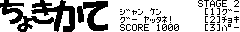
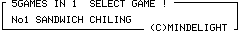
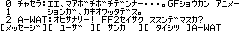
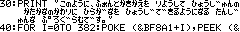

ポケコン
==

日本国内で1980年代から1980年代にかけて普及した、携帯用の小型コンピュータのことを、ポケットコンピュータ、略してポケコンと呼びます。

このリポジトリでは、私が個人的に作成したポケコン用のソフトウェアを公開します。

動作環境
--

このリポジトリのソフトウェアは、次の環境で動作します。

- [SHARP製 PC-E500系 ポケットコンピュータ](https://ja.wikipedia.org/wiki/%E3%83%9D%E3%82%B1%E3%83%83%E3%83%88%E3%82%B3%E3%83%B3%E3%83%94%E3%83%A5%E3%83%BC%E3%82%BF%E3%81%AE%E8%A3%BD%E5%93%81%E4%B8%80%E8%A6%A7#PC-E500%E7%B3%BB)

目次
--

### ゲーム

1. [だるまさんがころんだ５ ](./games/daru5/)

2. [だるまさんがころんだ６ ](./games/daru6/)

3. [あとだしじゃんけん ](./games/jyan/)

4. [5 GAMES IN 1 ](./games/5in1/)

5. [縦方向ドット避けゲーム](./games/vdot/)

### ツール

1. [キャラクターエディタ](./tools/cedit/)

2. [オフラインチャット ](./tools/chat/)

3. [ひらがなフォント ](./tools/font/)

ライセンス
--

- [LICENSE](LICENSE)

問い合わせ
--

- 不明点などがあれば [Twitter](https://twitter.com/programlet) でお気軽にお尋ねください
